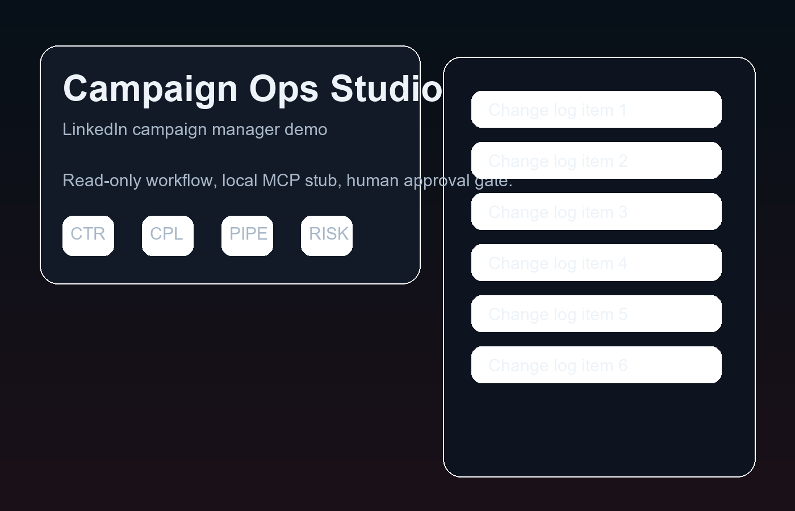

# LinkedIn Campaign Manager

A polished, read-only demo app that turns the LinkedIn Campaign Manager role into a single-operator workflow.

> Built entirely by [Codex by OpenAI](https://openai.com/codex) with human oversight.

## Preview



## What it shows

- campaign queue management
- pacing and optimization monitoring
- a local Metadata.io MCP stub
- a human + AI operating model with approval gates
- mock API routes for demo interactions
- exportable approval memo and change log

## Stack

- Vite
- Vanilla JavaScript modules
- Local development-only mock API middleware

## Files

- `index.html` - app shell
- `styles.css` - visual system
- `src/main.js` - UI wiring and state
- `src/data.js` - demo data
- `src/mcpStub.js` - local MCP stub contract
- `vite.config.js` - mock API middleware

## Safety

This is intentionally non-destructive.
The stub never calls live ad platforms.
Human approval is required before any action that would affect a live environment.

## Run

```bash
npm install
npm run dev
```

## License

MIT, see [LICENSE](./LICENSE).
